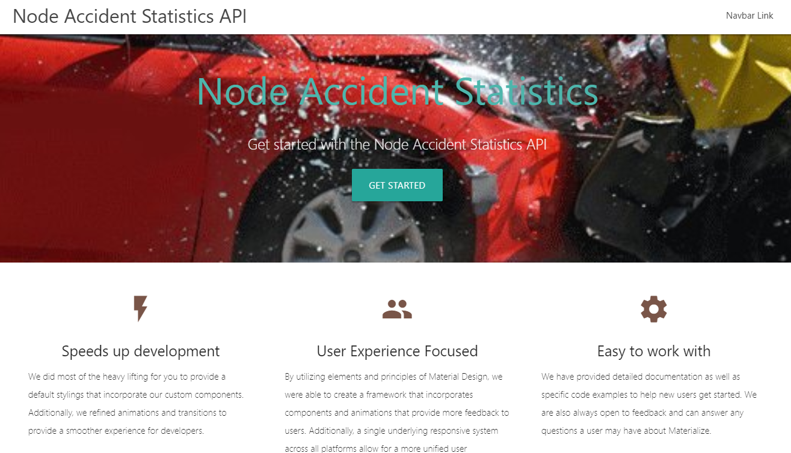

# Welcome to your first indaba
So, you may be asking what is an indaba? As a native South African, I have often used this term out of context, but appropriately, at least in this context. Officially an indaba is an important meeting or conference held by the Zulu or Xhosa people. However, we South African's overload this by saying "that is your Indaba my bru", meaning good luck and you should solve this whatever desperate way you can.

You may be asking yourself what does this have to do with the Git Playground? This will soon be a series of real world Katas, and for you that is about choosing how you solve your indaba. An indaba is really a kata type of your choice exercising a lot of real world issues. Essentially the gist of it is below and if you are interested in how it is solved by me, look at my indaba src within the repository. Good luck my bru or sister!

Full stack indaba is a *Marathon Indaba* making you a *Shaka Zulu*. Solving the front-end using my backend solution, or the data part only, or the domain logic is more a 5 km run to half a Comrades marathon, making you a *Senzangakona* or the father of something great. If you just want to learn about how I solved it, academic or to understand the gist of what this is about, you will just have to be a *Voortrekker* or "forward walker". There is also a business aspect of coming up with good business cases for new and interesting features within each problem domain, trying to think of other things to do outside of the given requirements, making you a *Tito Mboweni*. Finally it would be great to do a *gist* about what you observed from the solution, what unique value you offered whether it is speed, elegance, visual design or feature rich business value, this is your creative writing space to comment on.

The structure of a typical indaba should start with some real world issue that needs an obvious solution. The solution can then be extended with creative ideas to facilitate a topic or simply by necessity making up the simplest requirements on a topic of interest like *security*, *caching*, *coding practises* or anything else you can add to this topic to make it complete. For anyone trying to do a part of the problem, look at the business or technical requirements to make sure you develop the part of the puzzle to fit in with the existing other components.

Why the Git Playground? Originally I tried to utilise the Git API as a starter. In actual fact I abandoned the idea and kept the name only. As it is hosted on Git, that is probably the only Git thing related to this real world kata play ground.

# Transport for London Indaba

Transport for London have created an endpoint that returns an abundance of data without options to paginate, filter, sort or cache data. You can see more about this API here within the [api.tfl.gov.uk](https://api.tfl.gov.uk/swagger/ui/index.html?url=/swagger/docs/v1#!/AccidentStats/AccidentStats_Get). Thank you London TFL for hosting this huge API to help us have our first Indaba to make it better for you.

My original reason for stumbling across this API was to find some statistics about my menacing cycle route through London city traffic, to resolve where I should cycle safely and what roads I should avoid. This API was a little tricky in helping me safe-up my route and returned, on average, more than fifty thousand records per year, with no option to filter or return the data in some other useful order. I thought this is a good opportunity to create a full stack, partial or minimal solution depending on which Indaba you decide to endure down.


This API is a great way to exercise the first real world solution, for not only creating a better API, but also to exercise different skills in solving real world API problems.
Remember to test drive your solution and if you are going to follow anything, make sure it is the KISS principle to make this better than it is without being as "simple" as it is.

## Client or Domain indaba
This is essentially the heart of the project or the core of your domain. This will contain the model to marshal data into, if you think this is needed, and a client to connect the the TFL API. Any other strategies to help bolster the functionality, should be done within this library.

### Business Requirements

* Allow data to be easily queried and filtered with the *api.tfl.gov.uk* *AccidentStats* API.

### Functional Requirments

* Allow for a severity filter for filtering from *serious* to *fatal*.
* Allow for a date range, *from* and *to*, if not supplied, use 2017-01/01 to 2017/12/31 as the default.
* Date range validation should be applied with no earlier than 2005 and no later than a configured maximum year, 2017 at the moment but this may change soon.
* Create a console application that will demonstrate the consumption of your client as a simple user interface, where you will demonstrate paged data with a page size of twenty, data from the *1st of January 2014* to the *31st of December 2017*, with a severity of fatal. The final result should be sorted by *date descending* so cater for ways of sorting by several options, but at least by date descending and see the JSON below for all the sorting options.
* Look at the TFL web API to understand the schema, data and single API point
```json
{
	"id": 0,
	"lat": 0,
	"lon": 0,
	"location": "string",
	"date": "2018-10-06T02:10:11.021Z",
	"severity": "string",
	"borough": "string",
	"casualties": [{
		"age": 0,
		"class": "string",
		"severity": "string",
		"mode": "string",
		"ageBand": "string"
	}],
	"vehicles": [{
		"type": "string"
	}]
}
```
* Create a caching mechanism so that a range of years can be queuried efficiently, reducing round trips to the server and the inherent latency that comes with retrieving data over a network.
* Paginate the data, with the default page size set to 100, restrict the amount of data being returned, with no more than 1000 and the default current page set to 1.
* Represent *Severity* as an enumeration with values of Serious = 0, Slight = 1 and Fatal = 2.

### Non-functional Requirments

* Ideally should be able to run on any operating system.
* All methods should be asynchronous.
* Data needs to be outputted ideally as JSON or the same as the original content, which is JSON.


### Implementation/Transition Requirments

* Where possible follow a traditional test pyramid and keep the acceptance/integration test to a minimum, ideally driving outside-in with tests until you have a final solution.

## Database indaba

This is an opportunity to redesign the data store with data persistance of your choice.

### Business Requirements

* Persist the data to a local durable storage of choice optimising any shortcomings from the original design.

### Functional Requirments

* Create schema's to persist the data, if using a schema based storage, by representing *AccidentStatistics* 1-1 or more on *Casualties* and *VehicleDb*. You can extend the schema to include a *TransportTypes* that will help describe the *"vehicle type"* and *"casualties mode type"* enumeration values that get returned from the live data, but will only be possible when you understand the distinct values supported at the time and if all values are mandatory or supplied. The descriptions of these values can be discretionary and can be literally a humanised version of the enumeration.
* The database must have some automation layer for seeding the data on the first run of the system from the live site. Add a *README* to help describe what needs to be done.
* Create a *readonly repository* responsible for reading the data.
	* The ability to count the full amount of data being returned
		```csharp
		// example
		Task<int> Count(Expression<Func<AccidentStatisticDb, bool>> filter = null);
		```
	* The ability to return actual paginated data with options to filter and sort the data accordingly.
		```csharp
		// example
		Task<Paging<AccidentStatisticDb>> Get(
            Expression<Func<AccidentStatisticDb, bool>> filter = null,
            SortOptions<AccidentStatisticDb> sortOption = null,
            int page = 1,
            int pageSize = 100);
		```
* This is not necessarilly a CRUD based repository, but as the data needs to be seeded from the live site, there is no issues in creating the repository as *CRUD based* for the purpose of reading and writing the data.
* Represent the final consumption of the repository within a console based application that can demonstrate:
	* Seed and generate the database if non exists.
	* Show a count of *AccidentStatistics*, *Vehicles* and *Casualties* within the database.
	* The show paginated fatal fatal accidents from the *1st of January 2005* to the *31st of December 2017* displaying the *borough* where the accident occured, the *long date and time* it occured on, some summary information about the pagination and data severity in any format you think will help show to the user what you have achieved through this repository.

## API indaba

This will be used to host a REST based API, if you plan to integrate this with my existing frontend project, you will need to get information from the frontend section about what needs to be set, like CORS and other details. If you have the desire to work on other API types, like *GraphQL*, feel free to do so and remember if you are trying to work with an existing stack, you will need to alter the frontend project to work with this aletration.

### Business Requirements

* V1 API needs to work with the live TFL accident statistics *domain indaba* to host the data as a paginated queryable solution.
* V2 API, the architect has given you reign to optmise the existing API by hosting it with your own durable layer, see the *database indaba* for more information.`
* Caching should be in place to optimise the user experience through API mechanisms a browser can support like Browser Caching.

### Functional Requirments for V1

* The base URL should be *"http://localhost:9000/"*.
* The path segment should be *v1/accidents*.
* Assuming you are producing a REST API, you should support the *GET* verb.
* The URL should support several query params from the URL and none, see defaults for more information:
	* **accidentStatisticsQuery.from** or **from**: Start Date and if left null will default to the configured maximum year.
	* **accidentStatisticsQuery.to** or **to**: End Date and if left null will default to the end of the configured maximum year.
	* **accidentStatisticsQuery.sortBy** or **sortBy** or **orderBy**: Sort by options are : *DateAscending, LocationAscending, DateDescending (default if left null) or LocationDescending*.
	* **accidentStatisticsQuery.page** or **page**: Current page from 1 to (n-1) where validation needs to be added for less than 1 and greater than max.
	* **accidentStatisticsQuery.pageSize** or **pageSize**: Current page size defaulted to 100 and no greater than a 1000.
	```
	http://localhost:9000/v1/accidents?severity=Fatal&orderBy=LocationDescending&page=1&pageSize=3
	```
* Validate for null filters or any values that should not be assigned

### Functional Requirments for V2

* The base URL should be *"http://localhost:9000/"*.
* The path segment should be *v2/accidents*.
* Assuming you are producing a REST API, you should support the *GET* verb.
* The URL should support several query params from the URL and none, see defaults for more information:
	* **accidentStatisticsQuery.from** or **from**: Start Date and if left null will default to the configured maximum year.
	* **accidentStatisticsQuery.to** or **to**: End Date and if left null will default to the end of the configured maximum year.
	* **accidentStatisticsQuery.sortBy** or **sortBy** or **orderBy**: Sort by options are : *DateAscending, LocationAscending, BoroughAscending, AccidentStatisticIdAscending, TflIdAscending, DateDescending (default if left null), LocationDescending, BoroughDescending, AccidentStatisticIdDescending,TflIdDescending*.
	* **accidentStatisticsQuery.page** or **page**: Current page from 1 to (n-1) where validation needs to be added for less than 1 and greater than max.
	* **accidentStatisticsQuery.pageSize** or **pageSize**: Current page size defaulted to 100 and no greater than a 1000.
	```
	http://localhost:9000/v2/accidents?severity=Fatal&orderBy=BoroughDescending&page=1&pageSize=3
	```
* Validate for null filters or any values that should not be assigned

### Implementation/Transition Requirments
* Recreate the API allowing for options to query the TFL data for the purposes of what you want the data to do. You need to use the domain to show data and so any caching or optimisations need to be configured through the API contract. Remember this needs to be able to run through a browser or postman so allow for a simple and intuitive user experience.
* Create two versions of the API with the intention of having one use the live site data and the second, a complete redesign using the database indaba to build out a service that does what you need efficiently. The concept behind doing two versions is firstly it starts you thinking in terms of versioning the API, secondly most times you are not able to redo something, so you create anti-corruption layers or bubble context to interact with legacy or third party services and if it is slow, you bolster it where you can.

## Front-end indaba

* This is a visualisation of the data, creating business reasons for consuming this API. 
* Web solution to be hosted with a browser.  
* This requires all the indabas's above, and if this is the case, you may want to do this outside in starting from the web client and then building each bit of the puzzle as you need it.
* Create components based on a set of features you feel would help to represent the data in each of the indaba's above.

### Business Requirements

* Create a london based map component where a user will be able to see data based on severity, a range of dates and some summary information about the accident visually on the map.
* Create a list component that describes the accident information in human readable format allowing a user to quickly assimilate what happened.
* Create a statistical component that allows you to group on multiple bits of information to present general accident statistics possibly using vehicle types, location stats, or any other information you feel will be useful for analysis purposes.
* Create a query component that will allow both versions to be used side by side exposing ways of seeing visual metrics and data being returned.

## Study, Business or Gist indaba
Do not look at this if you want to solve this on your own but if you are interested in understanding or writing about something related to the above scenarios then carry on. This is my indaba and will explain roughly how I chose to solve my problem. Some of the requirments are missing that may have been applied above and some ideas where exploritory in my code to help me come up with the ideas. My naming convention is related to the technology stack rather than the actual domain.

### Set up development environments

1. This assumes you have Visual studio or VSCode. The solution used .Net framework 4.6.2 but I could have easily done this in .net core, just chose to do it this way as I was testing FLURL and Bddfy for a project that was not using .net core and so I continued down this route.
	1. Download the git source.
	2. Open *GitPlayground.sln* in the root of the project.
	3. **NOTE:** some of the tests will need to be fixed because they rely on live data and your environment may be synchronised differently, or possibly not setup at all. The TFL site has dynamic data, mainly two versions of the data depending on the load balancer you hit. I have created tests that will be easy to repair json data using your locally configured compare tool and when the compare fails for difference, just synchronise what is on your local setup.
	4. **The TestConsole** is the simplest solution for solving the domain problem, and the poor man's UI for looking at how it works, other than the tests. The console will simply load the Transport for London client using an autofac dependency injection framework and show severe fatalities between 2014 and 2017. All the trace outputs will be logged to the window showing when this is loading from the server or when being loaded from my custom in memory cache, and then will run through the details one page at a time. The console will pause at the end for you to scroll through the data to view what happened.
	
	5. **The domain** data serialized the data into POCO classes. I tried initially to get away with doing it into a dynamic object, to see if I could get away with doing nothing, but in the end, I felt it was beneficial to have this strongly typed as dynamic can be clunky. I chose to use Flurl as I usually take time to create an HtmlClient builder, and then tests to support this and I found that in the end I created the same thing that looks like Flurl's ugly cousin. Creating it from scratch may have been useful for this exercise but I say pick your battles. This is a very useful library and has a nice testing interface which I exercised within my own tests. Feel free to use the standard .net HttpClient, as this does nothing more than create a builder and make testing easier when mocking http endpoints. I included custom caching objects, sorting comparers, configuration extensions and various things to make a simple project more interesting. In your indaba, create what challenges you and your goals you want to face and drive.
	6. **The database project** utilises entity framework code first. To setup the database run *Git.Domain.EntityFramework.ConsoleApp* project and when it is loading, it will automatically create and seed all the data neded to run this project. The database takes two minutes to seed all the data from the live server, but feel free to cancel when you have generated some data to run things with. There may be tests that will start failing, just repair or ignore them until you have time or interest to generate the entire data stack from the seed. The other small issue is the seed is generated from the live server data and so the data does change from time to time, especially when 2018 data comes into fruition. The same data can be generated from running the *Git.Owin.Api* too so if you want to bypass the console, feel free. This was the first consumer of the project, before the *Owin.Api* version 2.0 API was enhanced to expose this. Here is more information on an interesting blog for a full repository and some good practises [Repository blog](http://blog.gauffin.org/2013/01/repository-pattern-done-right/). Below is a typical example of what the console states when seeding the data. If you run the Api, it will probably output this information in the Visual Studio output debug window.
					
	7. **The git.owin.api** is a self Hosting Owin API run in a simple console application. It simply stays up by virtue of a *console readline*, and would usually be done more robustly as a service, or using [Topshelf](http://topshelf-project.com), where you can configure the application in different modes using console arguments. The API is self-documenting with the swagger option visible in the console, but I can say that it needs love and caring and is mostly just there to show an entry. CORS is the first thing you will need if a front-end will need to call the service you can see how I included customisations to easily configure projects. I could query any bits of data exposed in my API through simple human readable mechanisms making it intuitive to use through a browser.
	
		1. A few more links of interest for anyone wanting to self-host, see [Owin self-host](https://docs.microsoft.com/en-us/aspnet/web-api/overview/hosting-aspnet-web-api/use-owin-to-self-host-web-api).
		2. Autofac and Owin see [integrating autofac into the Owin pipeline](https://autofaccn.readthedocs.io/en/latest/integration/owin.html).
		3. Setting up Swagger see [Swashbuckle](https://github.com/domaindrivendev/Swashbuckle).
		4. Setting up Web API 2 see [ASPNet Web API 2 release notes](https://docs.microsoft.com/en-us/aspnet/visual-studio/overview/2013/release-notes#TOC11)
		5. Webhosting see [Configuring Web API with ASP.NET Hosting](https://docs.microsoft.com/en-us/aspnet/web-api/overview/advanced/configuring-aspnet-web-api#webhost)
		6. More information on CORS see [Enable cross-origin requests in ASP.NET Web API 2](https://docs.microsoft.com/en-us/aspnet/web-api/overview/security/enabling-cross-origin-requests-in-web-api)
		7. The caching mechanism is very simple to implement, and here is an example of the source library I utilised. I could have developed this with my memory caching mechanism in my domain but did not want to spend time creating attributes and testing this so I chose this library because it is very configurable. [Source code to the library I consumed](https://github.com/filipw/Strathweb.CacheOutput)
		8. Learn more about logging [Serilog](https://stackify.com/serilog-tutorial-net-logging/)
		9. Configuring logging in App Settings[Serilog Settings](https://github.com/serilog/serilog-settings-appsettings)
		10. Learn more about Web API on Pluralsight and Microsoft [Web API course material](https://www.asp.net/web-api)
	8. Started a node typescript server side project hosting the equivalent Owin API, but using Node. At the moment the the v1 API is finished, with some clean up still to do, however the project was also extended to host static contents with views that could be dynamic, introduce Materialize within the basic pages. [src/node-accident-statistics](src/node-accident-statistics)
	
	9. My angular project was written using vs code and with latest Angular Cli to produce an Angular 7 ngAccidentStatistics project, but feel free to use an editor of your choice that works well with node. For setup and project details see more within [src/ngAccidentStatistics](src/ngAccidentStatistics), related to installing the latest version of Node and the Angular CLI. I use bespoke testing mechanisms that worked well for me on previous projects, creating a testing folder to represent every component/service, would help other unit tests mock this component and allow you to setup the expectations, therefor creating a true unit test rather than a component/integration test, but this may be overkill in the JavaScript world. Other known design issue relates to error handling and lack of visual animation indicators to help user's to understand data is being loaded asynchronously or worse yet, failing to load in the background. This was done purposefully for lack of time and as a slight compromise, the query component does have error handling, which I thought I would visually expose to fail like when dates are outside of the range or when I forgot to start the *Owin API*. Always cater for successful and unsuccessful scenarios in a production system because expecting the data to always be there is setting yourself up for failure. These components did not need to inform the user of an issue, would just be empty of content, which is informative enough in this scenario but should always describe obviously that there is an issue. Creating visual animations based on the *HttpClient* is also fairly easy to implement in Angular 7, with the enhanced HttpClient so always enhance a users experience by creating this kind of visual cue.
		1. The first component is a map component visualising the different dates, map settings, severity and visual configurations using the Leaf map library, which I think is fantastic and open source. I even included the Geolocation framework to set your position, but  this is only because I am doing a certification on this stuff and wanted an excuse to use it, so play hard with it like I did.
		
		2. The next component allows me to query the data and visualise the output. There is nothing to it except the fact that I do not limit the amount of data being returned. This was done intentionally for you to see speeds and issues, but in a production system, you should always add logic to restrict this, so TFL can laugh at my poor decision not to do this, as we retrieve lots of data for no good reason. Another poor aspect to my solution is I have database Id's serialized out and did not chose to remove the data or create some sort of data transfer object to represent this data. My decision was based on speed of data generation and could have chosen to include a *jsonignore* attribute on those values but decided I would output the values until its a problem - don't do this in a production solution. The query component is now the only component that can query my version 1.0 and 2.0 API, which still interacts with the live server utilising my caching enhancements, a representation of a solution where it is not possible to own this data, and the final which is in my persistence layer and totally in my control.
		
		3. The final component is a list component describing what happened. This is also evident in the popup on maps. What is still bad, and will be resolved soon, is the strange enumerated values to represent the vehicle types and modes. I will solve this for both API's but I had more pressing things to achieve.
		
		
	10. My react project is going to be developed as a typescript project. For setup and project details see more within [src/react-accident-statistics](src/react-accident-statistics). I have started developing the first component and it went well, with one small snag and that was related to the relative pathing of components and make sure you use relative rather than full path. The architecture promotes lots of small components, the same with Angular, however Angular has a more sophisticated binding mechanism, with *directives* and *pipes* which are like components in themselves and Angualr supports lots of built in  structures to help with date formatting, JSON and the list goes on, lending itself more to not needing smaller components as it will still be very readable and maintainable. I need to warn you that the react typescript CLI has small issues and creates far less than the Angular CLI, probably on purpose, like no integration or e2e setup and errors with basic yhings you will need to search solutions for to get going. The Angular CLI have raised the bar for the React CLI, but to be honest both have spoilt developers wrotten by giving us frameworks that allow us to focus mostly on our business needs. Not too long ago, I was creating Grunt and Gulp scripts to automate a lot of what I get for nothing, so Kudos to the guys who open sourced these great CLI's as they promote consistency and help us develop quicker.
	
	

# summary

Enjoy doing Indabas and remember solving small issues well helps give you a spear for bigger problems.
Umkhonto we sizwe and good luck!


