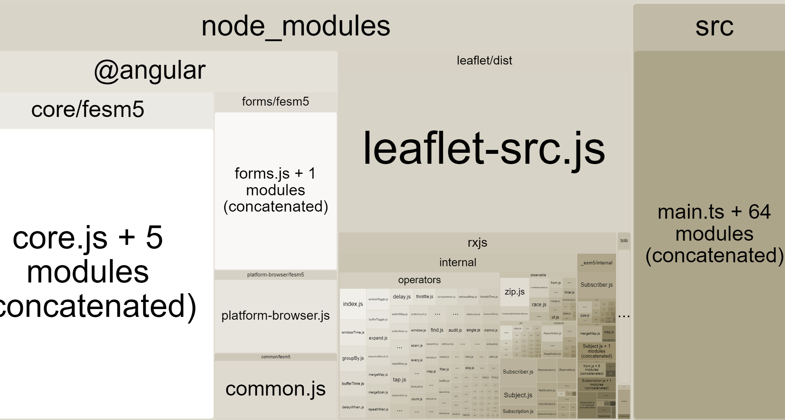

# NgAccidentStatistics

This project was generated with [Angular CLI](https://cli.angular.io/) version 7.0.4. Most of this project was developed using standard Angular patterns which can be understood further down with references to the CLI and very good Angular documentation.

The only part I wanted to ellaborate on is my testing folder within each folder. When creating a component or a service, I always create a test component and test module that can be utilised by whatever consumes the artifact. This made things very simple for testing and always puts consuming the component in your design choice. I created a simple testing mechanism for RXJS methods exposing Jasmine Spies for mocking the data expectations and instead of doing Jasmine Marble testing, I exposed simple observables from json data files which allowed easy configuration of different tests, see code for more details. This made it very easy to test data for different scenarios. I kept it simple for testing the components and this strategy lends itself to more complicated scenarios. Take a look at the diffent *testing* folders for a better idea of what I am talking about.

## Development server

Run `ng serve` for a dev server. Navigate to `http://localhost:4200/`. The app will automatically reload if you change any of the source files. A specific docker start was prepared to facilitate the host binding onto the local machine, but seemed a little excessive. I think there may be better ways of implmenting  

## Run code on Docker

Run `docker-compose up` in the root of the project and this will generate a working docker image with all the code released in production mode.  

### Issue raised on 12th March 2019
I have a small problem I was forced to introduce until the fix is officially resolved, knowing full well what side effect I would be introducing, and felt that it raised an interesting conversation point. 

The initial problem was, I was forced to upgrade the CLI and various dependencies because of security reasons raised from NPM and Git. Happy that I am being notified about security issues, upgrading my project led me down a rabbit holes of typical JavaScript development issues like dependency discrepancies, lock file discrepancies, more security warnings, with the option to fix automatically. In the end my final issue was related to *RXJS* and the reference to *rxjs/internal*. No matter what path I used, loading a docker image failed. My final solution was to reference the `rxjs` file as opposed to the specific file `rxjs/internal/Observable` and so the result is I can build a docker file, however I have also included a lot of other rxjs files that I did not want to include. This utility `$ ng build --prod --stats-json` and the actual viewer ` $ npx webpack-bundle-analyzer dist/stats.json`, which I have exposed as npm/yarn commands, shows visually what are the biggest files generated, even after bundling. Beware of these things as bloating a project unnecessarily has massive impact on performance, and when I first started developing web applications, I would use the base file so I could reference one thing rather than several little things. It made my development life easy at the detriment of performance, but I was not aware that specific paths could reduce the memory, so I thought I would pass this gem on to you. You can see the leaf map library is the biggest library in the project, a library that is one single file and so has a huge footprint.

## Code scaffolding

Run `ng generate component component-name` to generate a new component. You can also use `ng generate directive|pipe|service|class|guard|interface|enum|module`.

## Build

Run `ng build` to build the project. The build artifacts will be stored in the `dist/` directory. Use the `--prod` flag for a production build.

## Running unit tests

Run `ng test` to execute the unit tests via [Karma](https://karma-runner.github.io).

To debug within tests, simply place *console.log* statements or *debugger* where you want to debug and chrome has all sorts of watches to evaluate and step through the problem.

Viewing the debug output can be seen within the terminal window, as well as the same information from the chrome browser, which means you could essentially run in headless mode to speed up the tests and see teh results within the terminal.

## Running end-to-end tests

Run `ng e2e` to execute the end-to-end tests via [Protractor](http://www.protractortest.org/). Make sure the Owin Api is running in the background so the test can access the data.

A summary of the results can be seen within the output.

## Further help

To get more help on the Angular CLI use `ng help` or go check out the [Angular CLI README](https://github.com/angular/angular-cli/blob/master/README.md).

## Learn RXJS

This is a fairly complex area, but for more information check out the 
[Learn RXJS](https://www.learnrxjs.io/)

[What changed](https://www.academind.com/learn/javascript/rxjs-6-what-changed/)

[Learn about the new pipe operator](https://github.com/ReactiveX/rxjs/blob/master/doc/pipeable-operators.md)

[Creating streams in angular](https://blog.angularindepth.com/the-extensive-guide-to-creating-streams-in-rxjs-aaa02baaff9a)

## Map libraries

Take a look at utilising this with [openlayers map documentation](https://openlayers.org/en/latest/apidoc/) and the API if you wanted to use this map is [here](https://github.com/openlayers/openlayers)

Developed the map component with Leaflet JS, a fantastic open source map library in conjunction with the team of guys who exposed the Angular and Typescript wrappers to help within the Angular eco system [https://leafletjs.com/](https://leafletjs.com/).
