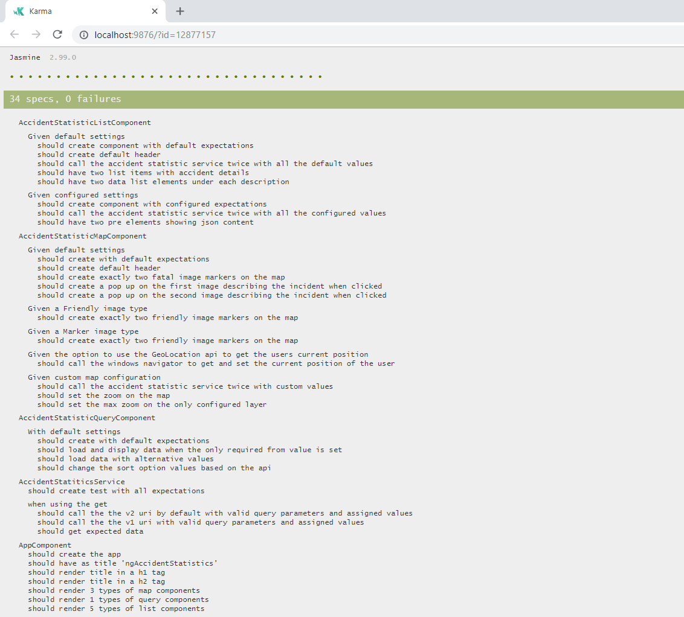
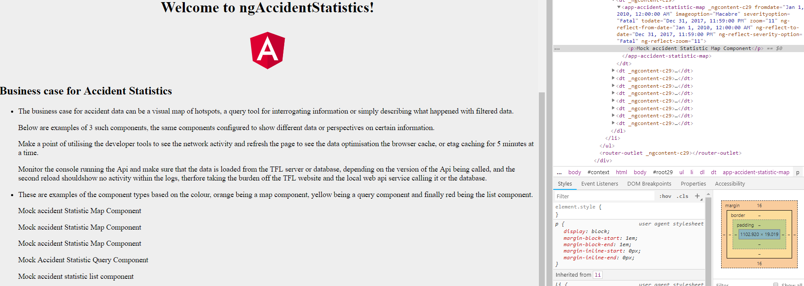
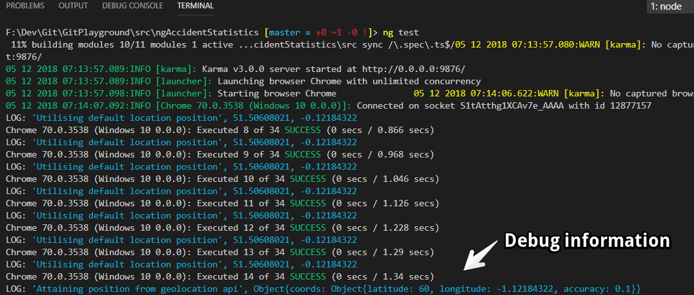
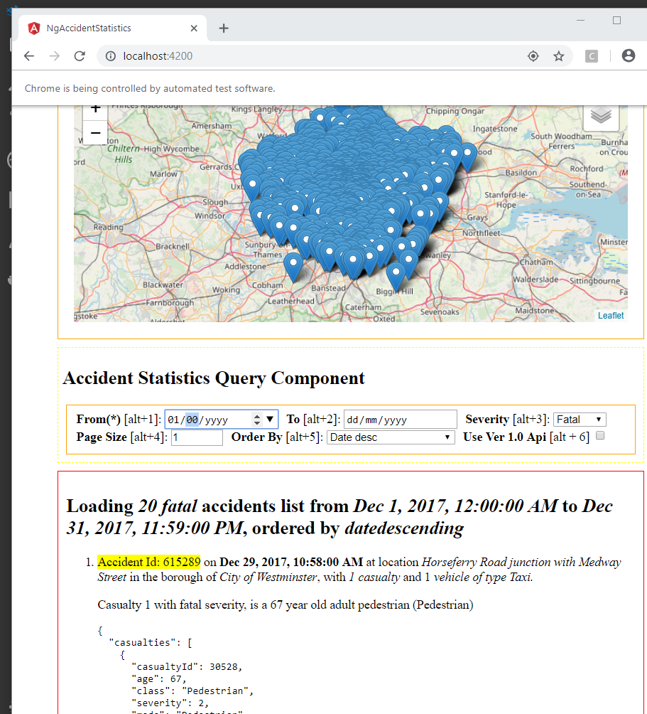
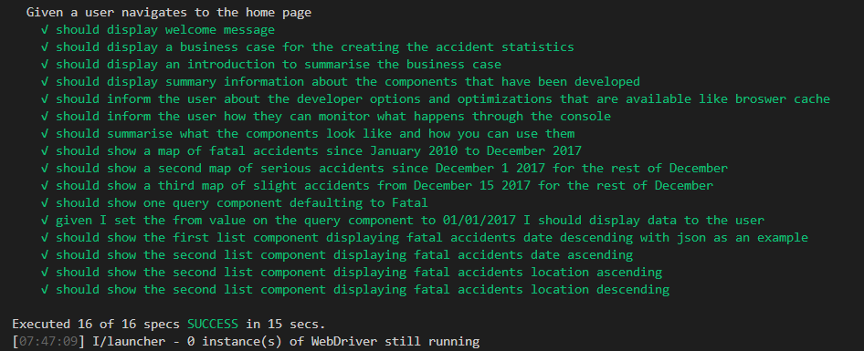

# NgAccidentStatistics

This project was generated with [Angular CLI](https://github.com/angular/angular-cli) version 7.0.4.

## Development server

Run `ng serve` for a dev server. Navigate to `http://localhost:4200/`. The app will automatically reload if you change any of the source files.

## Code scaffolding

Run `ng generate component component-name` to generate a new component. You can also use `ng generate directive|pipe|service|class|guard|interface|enum|module`.

## Build

Run `ng build` to build the project. The build artifacts will be stored in the `dist/` directory. Use the `--prod` flag for a production build.

## Running unit tests

Run `ng test` to execute the unit tests via [Karma](https://karma-runner.github.io).

To debug within tests, simply place *console.log* statements or *debugger* where you want to debug and chrome has all sorts of watches to evaluate and step through the problem.

Viewing the debug output can be seen within the terminal window, as well as the same information from the chrome browser, which means you could essentially run in headless mode to speed up the tests and see teh results within the terminal.

## Running end-to-end tests

Run `ng e2e` to execute the end-to-end tests via [Protractor](http://www.protractortest.org/). Make sure the Owin Api is running in the background so the test can access the data.

A summary of the results can be seen within the output.

## Further help

To get more help on the Angular CLI use `ng help` or go check out the [Angular CLI README](https://github.com/angular/angular-cli/blob/master/README.md).

## Learn RXJS

This is a fairly complex area, but for more information check out the 
[Learn RXJS](https://www.learnrxjs.io/)

[What changed](https://www.academind.com/learn/javascript/rxjs-6-what-changed/)

[Learn about the new pipe operator](https://github.com/ReactiveX/rxjs/blob/master/doc/pipeable-operators.md)

[Creating streams in angular](https://blog.angularindepth.com/the-extensive-guide-to-creating-streams-in-rxjs-aaa02baaff9a)

## Map libraries and better understa

Take a look at utilising this with [openlayers map documentation](https://openlayers.org/en/latest/apidoc/) and code is [here](https://github.com/openlayers/openlayers)

Take a look at [https://leafletjs.com/](https://leafletjs.com/) for information about the map utility
Angular version and typings, look at [https://openlayers.org/en/latest/apidoc/](https://openlayers.org/en/latest/apidoc/) for extending what is here

[Setting markers](https://journocode.com/2016/07/07/set-marker-map-leaflet-js/)
