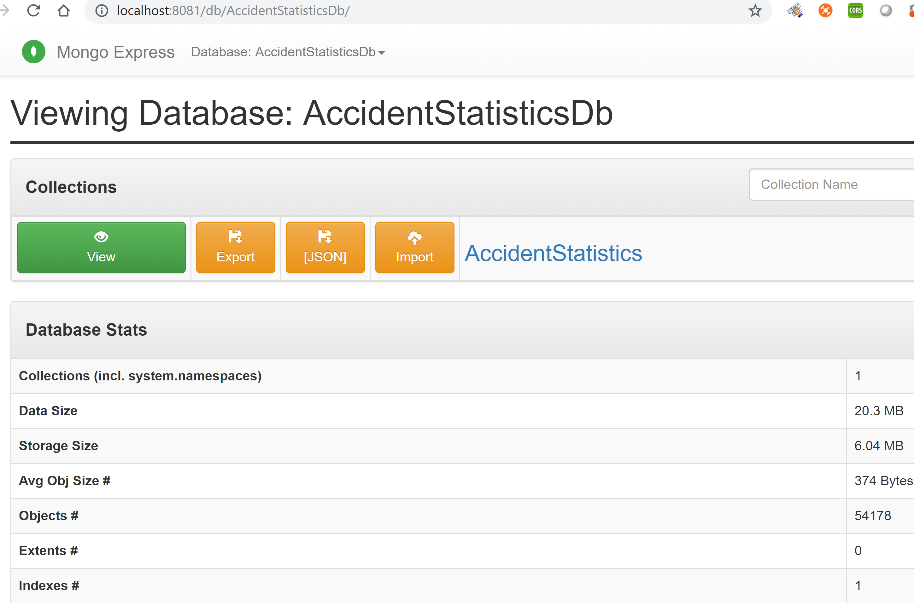
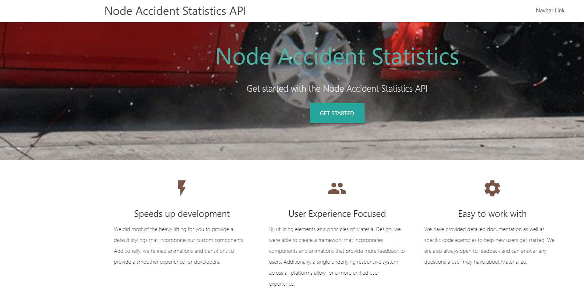
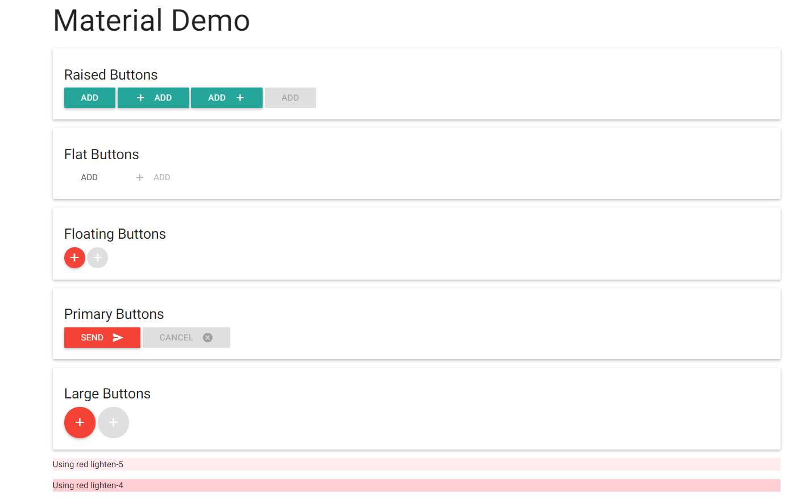
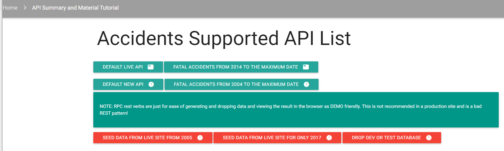
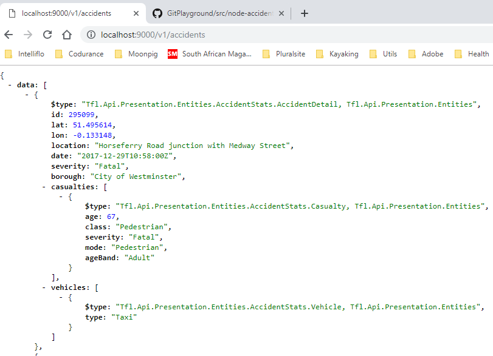
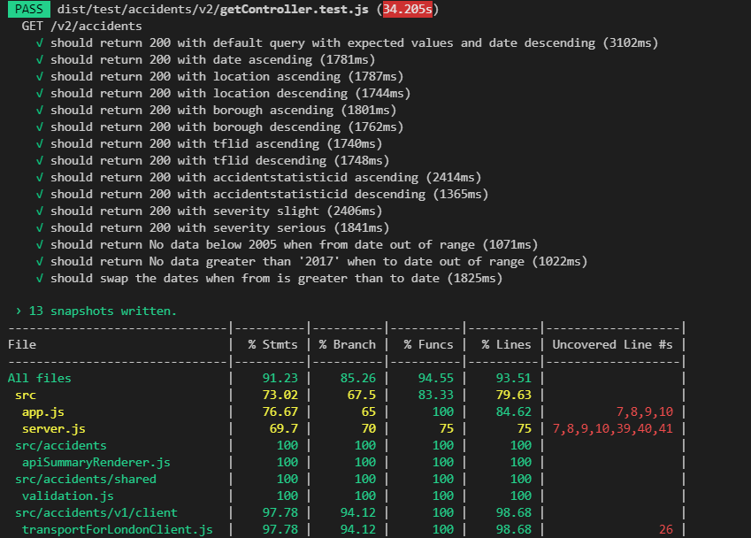
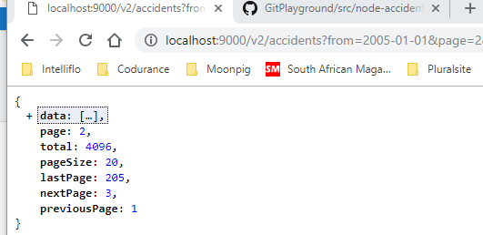
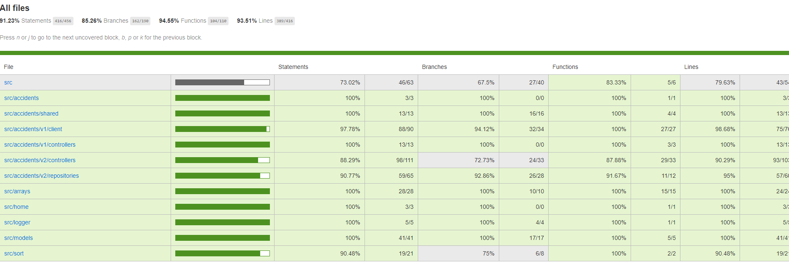

## Compiling and running the project

    ```
    NPM/YARN INSTALL: Initialise all the node modules
    NPM RUN "<Command>" ...
    YARN <Command> ...
    
    <Commands>
    "clean": To dist folder and files,
    "copy-assets": To copy custome files to a folder,
    "build": Build project to dist folder,
    "lint": lint and fix TS and JS issues,
    "serve": run the project,
    "tsc": Typescript compiler,
    "tsc:w": Watch and compile anything that changes,
    "dev:start": Start and debug,
    "dev": Develop and watch for file changes restarting node,
    "start": "npm run serve",
    "debug": Debug application through CHROME plugins,
    "test": Jest test with coverage,
    "test-build": Deploy just tests,
    "test-watch": Watch for test changes
    ```

## Docker Dev
* Download docker and install it on your local operation system
* https://docs.docker.com/get-started/part2/ documentation 
* Within the local *.env* file, make sure you comment out the `MONGO_URL=mongodb://localhost:27017` and uncomment the `MONGO_URL=mongodb://mongo:27017` for mongo to be run through the docker container, otherwise this file will be packaged with the wrong environment settings and not be able to share data out of the container.
* Run to start docker compose

    ```shell
    # to start
    docker-compose up

    # to stop
    docker-compose down 
    ```
* Here are the images related to Node [Node Images](https://hub.docker.com/_/node)
* In a production deployment of docker, there would be a requirement to preserve the data on subsequent deployments. Within the docker compose file, you will need to uncomment the data section, see *docker-compose.yml* for more comments in the file and create an empty `data` folder in the root, if it does not already exist. **NOTE** trying this on Windows or Mac is not supported as there is a bug mapping to the vbox or hyperv within these environments and as a result the data is not able to be bound together to the outside. 
* Finally if there is no Mongo Compass installed locally, there is an option to see the Mongo data using *Mongo Express* on *localhost:8081* as below.
 

## Creating a Typescript Node project

* Recomend the following https://github.com/Microsoft/TypeScript-Node-Starter#typescript-node-starter for learning typescript basics and configuration basics as well as node concepts translated to typescript
* Install latest **NPM** and **VSCode**
* Create a Folder and from within the folder run in a terminal
* In terminal run
    ``` 
    npm init.
    ```
* Install **dev dependencies** *npm install <package> --save-dev*
    ``` 
    npm install concurrently typescript lite-server --save-dev
    ```
* If you do not have tsc installed globally, do it
    ``` 
    npm install -g typescript
    ```
* Create a *tsconfig.json*
    ``` 
    tsc --init
    ``` 
* In our scripts object within *package.json* we defined our **TypeScript compiler** with *"tsc": "tsc"*, and our TypeScript compiler in **watch mode** *"tsc:w": "tsc -w"*, **lite server** as *"lite": "lite-server"* and finally our all-important start command.
    ``` 
    "start": "concurrently \"npm run tsc:w\" \"npm run lite\" "
    ```
* Understand the [Typscript compiler options](https://www.typescriptlang.org/docs/handbook/compiler-options.html), I defaulted to the same settings I use in Angular projects but feel free to alter it anyway you feel.

* [Understanding server light](https://medium.freecodecamp.org/how-you-can-use-lite-server-for-a-simple-development-web-server-33ea527013c9) for simply hosting static files and simple things until moving on to express or soemthing complex.

* Do a typescript with https://blog.risingstack.com/building-a-node-js-app-with-typescript-tutorial/

    * Create an express API utilising https://expressjs.com/

    * Use TSLint instead at https://palantir.github.io/tslint/
    ```     
    npm install tslint typescript --save-dev
    ``` 

* https://developer.okta.com/blog/2018/11/15/node-express-typescript
* The TypeScript compiler does the work of generating the JavaScript files and copies them to the dist folder. However, it does not copy the other types of files the project needs to run, such as the EJS view templates. To accomplish this, create a build script that copies all the other files to the *dist* folder.
    ```     
    npm install --save-dev ts-node shelljs fs-extra nodemon rimraf npm-run-all
    npm install --save-dev @types/fs-extra @types/shelljs
    ```     
    * Here is a quick overview of the modules you just installed.
        * [ts-node](https://www.npmjs.com/package/ts-node) Use to run TypeScript files directly.
        * [shelljs](https://www.npmjs.com/package/shelljs) Use to execute shell commands such as to copy files and remove directories.
        * [fs-extra](https://www.npmjs.com/package/fs-extra) A module that extends the Node.js file system (fs) module with features such as reading and writing JSON files.
        * [rimraf](https://www.npmjs.com/package/rimraf) Use to recursively remove folders.
        * [npm-run-all](https://www.npmjs.com/package/npm-run-all) Use to execute multiple npm scripts sequentially or in parallel.
        * [nodemon](https://www.npmjs.com/package/nodemon) A handy tool for running Node.js in a development environment. Nodemon watches files for changes and automatically restarts the Node.js application when changes are detected. No more stopping and restarting Node.js!
    
    * Node.js applications typically use environment variables for configuration. However, managing environment variables can be a chore. A popular module for managing application configuration data is [dotenv](https://www.npmjs.com/package/dotenv)
        ```   
        npm install dotenv
        npm install --save-dev @types/dotenv
        ```
        ```JAVASCRIPT    
        # Set to production when deploying to production
        NODE_ENV=development

        # Node.js server configuration
        SERVER_PORT=9000
        ```
    * Your Node.js application is off to a great start, but perhaps not the best looking, yet. This step adds [Materialize](https://materializecss.com/), a modern CSS framework based on Google’s Material Design, and [Embedded JavaScript Templates](https://www.npmjs.com/package/ejs) (EJS), an HTML template language for Express. Materialize and EJS are a good foundation for a much better UI.
        * [Tutorials](https://www.tutorialspoint.com/materialize/)
        * [Material Icons](https://material.io/tools/icons/?icon=featured_play_list&style=baseline)
        
        
    * This is not necessary, inactual fact I did not get it to work for various good or bad reasons, but interesting in the name of experimentation, securing your Node.js application is to configure Express to use the Okta OpenId Connect (OIDC) middleware and to see how the router would work under that context.
        ```
        npm install @okta/oidc-middleware express-session
        npm install --save-dev @types/express-session
        ```
    * Connect to MSQL Database starting with V2 and look at https://www.reddit.com/r/node/comments/77nx7y/any_examples_with_sql_server_connection_and/
        ```
        npm install --save mssql
        npm install --save-dev @types/mssql
        ```
* Debug in Node by attaching a debugger, rather than console.log https://nodejs.org/en/docs/guides/debugging-getting-started/
* Utilising Express Middlewares https://expressjs.com/en/guide/using-middleware.html
* Node imports and require and mapping to typescript caused a bit of confusion for me in the beginning, when I should use on or the other and how the mappings should occur. Installing the types node cleared confusions, vscode gave me the mapping through syntax. For more information look at https://blog.angular-university.io/typescript-2-type-system-how-do-type-definitions-work-in-npm-when-to-use-types-and-why-what-are-compiler-opt-in-types/ 
    ```
    const express = require('express')
    ```
    
* Cors and enabling Cors should be better understood with https://github.com/expressjs/cors
* Need to add browser caching as client suffers performance when this is not here. https://medium.com/the-node-js-collection/simple-server-side-cache-for-express-js-with-node-js-45ff296ca0f0

* Testing through [JEST](https://jestjs.io/) based on very initial topic of README and [Supertest](https://www.npmjs.com/package/supertest)

* NOTE: I suffered from this when I used JEST and wrote several tests expecting values from express. https://blog.campvanilla.com/jest-expressjs-and-the-eaddrinuse-error-bac39356c33a is the solution to running the tests sequentially. TODO at https://github.com/visionmedia/supertest/blob/master/lib/test.js#L59 for solving this more elegantly
* Debugging JEST stuff can be done with the following https://github.com/Microsoft/vscode-recipes/tree/master/debugging-jest-tests
* MongoDB is my database of choice as SQL in node seemed clunky. Decided to extend my NOSQL to MongoDB as I have extensive Couchbase expertise and hopefully some skills will transfer. https://www.tutorialspoint.com/mongodb/index.htm
    * https://www.w3schools.com/nodejs/nodejs_mongodb.asp for Node js
    * Install mongodb into node
        ```
            npm install mongodb --save
            npm install @types/mongodb --save-dev
        ```
    *  Here is a cheatsheet reference for Mongo query and SQL equivalent examples https://info-mongodb-com.s3.amazonaws.com/ReferenceCards15-PDF.pdf 
* Utilised a well written API caching library, which worked well for Typescript too and could easily extend to utilising REDIS,[apicache](https://github.com/kwhitley/apicache);





## Final thoughts
I really enjoyed working with Node, something I have used as a backing framework on Angular and just for mocking services and testing front ends. Typescript seemed to cause me problems for debugging and testing, but I think I can improve this experience more in later versions. Nock, Jest and Super Test are libraries I will utilise in my other web projects bringing so much to mocking HTTP endpoints. I was a little disappointed  with the speed of Mongo with Node, expecting faster results but I think there may be room for enhancement, placing it on *Ubuntu* and initiating more indexes. I would like to say, in their favour that it is something I have done and will try to improve it.